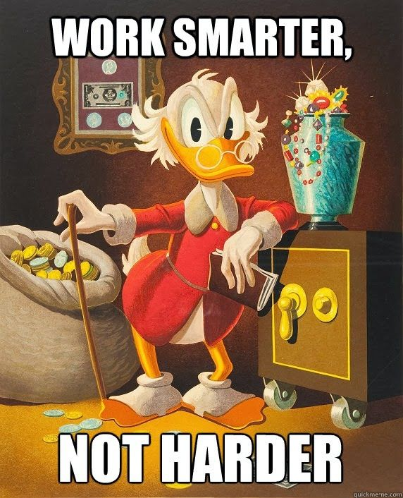
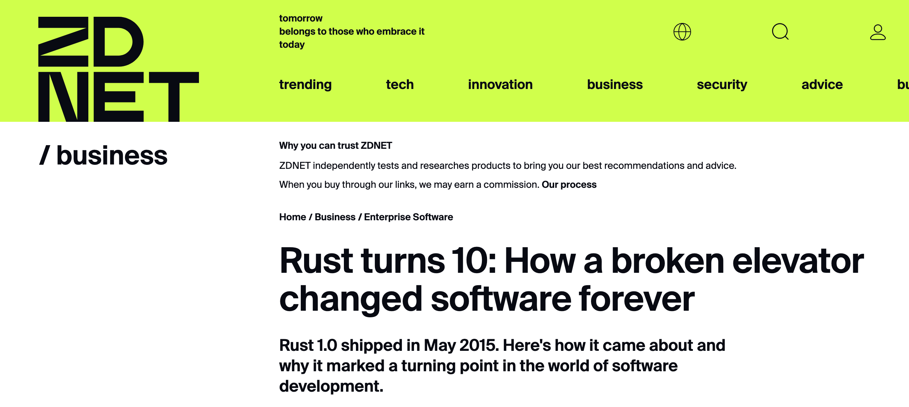
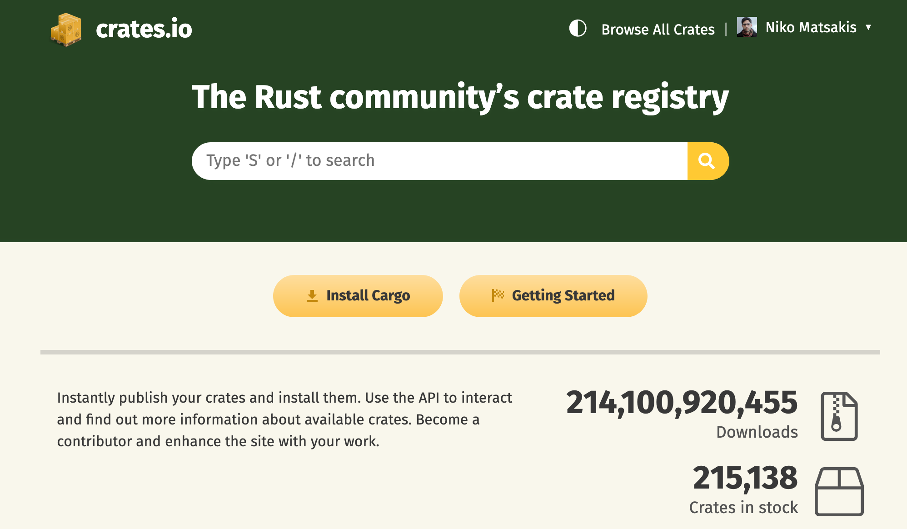
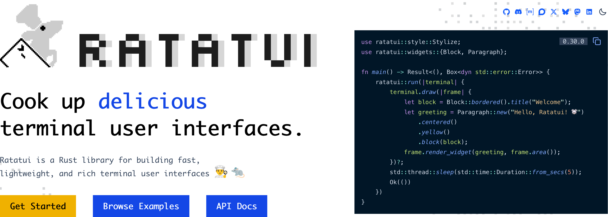
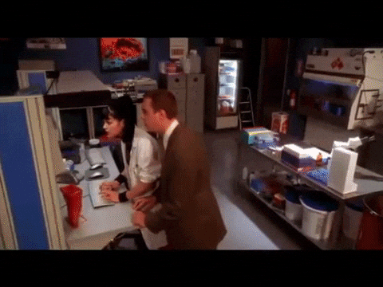

class: center
name: title
count: false

# Leveling up with Rust

## Why we think you should *just build something*

.center[.p60[]]

.center[Nicholas Matsakis and Jack Huey]

.left[.citation[View slides at `https://nikomatsakis.github.io/rust-africa-hackathon-2026/`]]

---

# We wish we could be there in person

--

.center[.p60[]]

---

# Rust at Mozilla in 2011

.center[.p60[]]

???

*Niko*

The original motivation for Rust came from Mozilla facing a problem.

They were competing against Chrome and, quite frankly, Google had a lot more developers and a lot more money to spend.

---

# Google

(from Mozilla's perspective)

.center[.p80[]]

???

Mozilla wanted a way to move faster. The browser was written in C++. Mozilla devs were excellent C++ hackers, but they still spent a lot of time debugging obscure problems.

Also, Firefox is open source, but C++ was a barrier for new contributors, it takes a long time to learn how to be an effective C++ developer.

---

# The idea

.center[.p60[]]

???

The idea for Rust was to do a grand experiment -- could we build a language that had all the power of C++, but which was more accessible, and more reliable, so that people could move faster, and so that new contributors could contribute to Firefox more easily?

---

# 10 years later...

.center[.p80[]]

???

So, here we are, 10 years after 1.0 -- 15 years or so since I personally started working on Rust. Rust is used in Firefox, but it's used in a bunch of other places to. So last year, Rust turning 10 got some of us thinking--- what comes next for Rust? And that led us to a project we call the vision doc.

---

# What are we today?

.center[.p80[]]

???

*Jack*

The idea of the vision doc was to help us answer some big questions about Rust.

We all have some general ideas about where Rust is used and why, but not all the details. Rust did make its way into Firefox, but where else it is used?

Earlier in the year, we started this group called to work on this thing called the "Vision Doc" with sort of two goals.

--

### Build a shared understanding of where we are

--

### Identify where we should be going at a high-level

---

# How did we do this?

--

## We listened to people

???

*Niko*

--

- Survey with 4200 respondents
- 75 interviews

---

# Lots of data...

## 4200 survey results

???

*Jack*

--

<pre> </pre>

| Location | Number | Percentage |
| --- | --- | --- |
| Europe | 3114 | 57.8% |
| US / Canada | 1308 | 24.2% |
| Asia Pacific | 692 | 12.8% |
| Middle East and Africa | 156 | 2.8% |
| Latin America and the Caribbean | 116 | 2.1% |

???

*Jack*

---

# Lots of data...

## 4200 survey results

<pre> </pre>

| Language | Number |
| --- | --- |
| Python (or similar) | 2894 |
| JavaScript / TypeScript | 1977 |
| C++ | 1603 |
| C | 1522 |
| Java or C# | 1437 |
| Bash | 1219 |
| Go | 981 |
| Only Rust | 280 |
| Other | ... |

???

*Jack*

---

# Lots of data...

## 4200 survey results

<pre> </pre>

| Domain | Number |
| --- | --- |
| CLIs | 3273 |
| Network services or cloud computing | 2701 |
| Embedded development | 1302 |
| Game development | 1139 |
| Machine learning or AI | 477 |
| I don't use Rust | 249 |
| Other | ... |

???

*Jack*
---

# Lots of data...

## 4200 survey results

<pre> </pre>

| Question | Responses |
| --- | --- |
| “How did you first get started using Rust? What was your experience like?” | 2610 |
| &nbsp; | |
| “What kinds of projects do you find to be a good fit for Rust and why? What do you find NOT to be a good fit?” | 2542 |
| &nbsp; | |
| “Is there anything that you found particularly challenging (or easy!) when learning or using Rust?” | 2435 |

???

*Jack*

---

# Lots of data...

## 75 interviews

???

*Niko*

--

<pre> </pre>

* 30-45 minutes
* Focus:
    * ask questions, let the user guide you
    * no wrong answers
    * Fun and...a bit challenging too
* Selected from survey, personal connections, recommendations
* People across domains and experience levels

???

*Niko*

---

# Not exactly what we were expecting

.center[.p80[]]

???

*Niko*

--

>**What we really don't have is enough data to say "if you do X, Y, and Z, that will really unblock Rust adoption in this domain".**

???

What we did learn was the kinds of things people are using Rust for and what the experience means for them.

---

# Rust is used...basically everywhere

<pre> </pre>

???

*Jack*

--

## Across different domains

--

## Around the globe

--

## At companies large and small

--

## For many different types of projects

---

# But *why*?

???

*Niko*

--

<pre> </pre>

# .center[Performance]
# .center[Reliability]

---

# But *why*?

--

## Network/Web Services

For strong reliability and performance

???

Large scale, real $

--

## Blockchain and Crypto

For library support

???

Crypto needed low-level perf

Those libraries led to Rust seeing usage in Blockchain

--

## Embedded

For performance and developer experience

???

Small devices, limited capabilities

--

## GUIs

For...fun?

???

*Jack*

---

# But *why*?

<pre> </pre>

# .center[Performance]
# .center[Reliability]

???

*Jack*

--

# .center[Versatility]

???

*Jack*

---

# Rust can go low to high

>Rust is more of a one-stop-tool that you can actually learn it and then use it for other purposes, like embedded, android, web services, and other stuff.

--

<pre></pre>

>This is language that will just make me stop thinking about using C and Python. So I just have to use Rust because then I can go as low as possible as high as possible.

---

# Rust makes you a better programmer

>this will make you a better programmer in those other languages

--

<pre></pre>

>...you start to look at your old code in a different light...it made me question a lot of code that I had thought was rock solid - things that you really hang your hat on. It made me question a lot of that stuff.

--

<pre></pre>

>...it's been very interesting to learn this very unique way of programming, I think it is the future

---

# Rust as a empowerment tool

.center[.p60[]]

---

# Rust as a empowerment tool

.center[.p60[]]

---

# Rust as a empowerment tool

>I was civil engineering and I studied from the front-end my own, self taught. I had no computer background. I got interested in Rust and distributed systems and designs and systems around it. I changed my major I studied CS and Rust at the same time.

---

# Rust is *fun*

.center[.p60[]]

???

*Jack*

---

# Rust is *fun*

>Feeling cool gives a lot of difference... the feeling of I'm writing the language that is considered super cool, makes it feel like playing a game, it's not work anymore

--

<pre></pre>

>I love Rust with all my heart...I don't think I've seen anyone that loves JavaScript the way Rust developers love Rust. Even in the community, they are obsessed with it.

--

<pre></pre>

>Rust is a language for people. It's human-centric in that kind of sense...it has always been obvious that that's been an intent rather than an accident... it's still I think one of the best communities I've come across.

---

# Interested in Rust yet...?

--

.center[.p40[]]

---

# Interested in Rust yet...?

.center[.p40[]]

---

# But how...?

--

<pre> </pre>

## .center[You're in the right place!]

---

# Go talk to people using Rust!

--

## Look for local meetups

--

## If there aren't any, host one

---

# Find support in your universities

## Talk to your professors

.center[.p50[]]

(If they're cool, that is.)

---

# Just build something

---

# Even the small things can be useful

--

.center[.p80[]]

---

# Even the small things can be useful

.center[.p80[]]

---

# Crates.io

.center[.p80[]]

---

# Ratatui

.center[.p80[]]

---

# Ratatui

.center[<video autoplay loop muted playsinline width="90%"><source src="./images/scope-tui-oscilloscope-music.webm" type="video/webm"></video>]

.center[[`scope-tui`](https://github.com/alemidev/scope-tui)]

---

# .center[Go forth and hack!]

.center[.p80[]]

