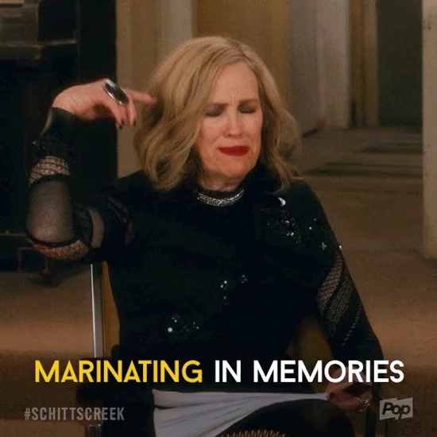
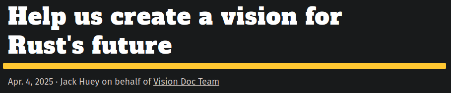
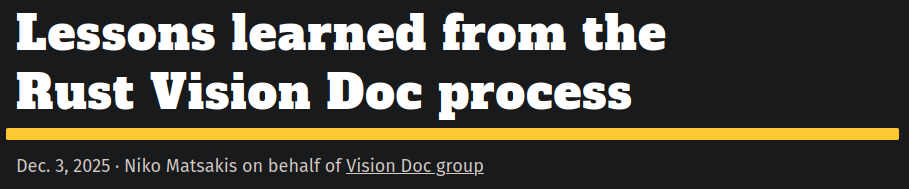
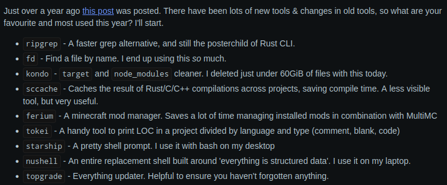
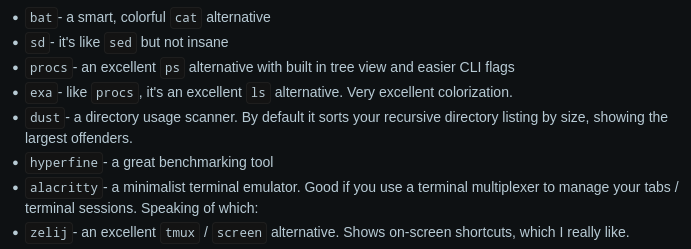

class: center
name: title
count: false

# Leveling up with Rust

## Why we think you should *just build something*

.center[.p60[]]

.center[Nicholas Matsakis and Jack Huey]

.left[.citation[View slides at `https://nikomatsakis.github.io/rust-africa-hackathon-2026/`]]

---

# Rust at Mozilla in 2011

.center[.p60[]]

---

# What about today?

.center[.p80[]]

--

### Build a shared understanding of where we are

--

### Identify where we should be going at a high-level

---

# Lots of data...

## 4200 survey results

--

<pre> </pre>

| Location | Number | Percentage |
| --- | --- | --- |
| Europe | 3114 | 57.8% |
| US / Canada | 1308 | 24.2% |
| Asia Pacific | 692 | 12.8% |
| Middle East and Africa | 156 | 2.8% |
| Latin America and the Caribbean | 116 | 2.1% |

---

# Lots of data...

## 4200 survey results

<pre> </pre>

| Language | Number |
| --- | --- |
| Python (or similar) | 2894 |
| JavaScript / TypeScript | 1977 |
| C++ | 1603 |
| C | 1522 |
| Java or C# | 1437 |
| Bash | 1219 |
| Go | 981 |
| Only Rust | 280 |
| Other | ... |

---

# Lots of data...

## 4200 survey results

<pre> </pre>

| Domain | Number |
| --- | --- |
| CLIs | 3273 |
| Network services or cloud computing | 2701 |
| Embedded development | 1302 |
| Game development | 1139 |
| Machine learning or AI | 477 |
| I don't use Rust | 249 |
| Other | ... |

---

# Lots of data...

## 4200 survey results

<pre> </pre>

| Question | Responses |
| --- | --- |
| “How did you first get started using Rust? What was your experience like?” | 2610 |
| &nbsp; | |
| “What kinds of projects do you find to be a good fit for Rust and why? What do you find NOT to be a good fit?” | 2542 |
| &nbsp; | |
| “Is there anything that you found particularly challenging (or easy!) when learning or using Rust?” | 2435 |

---

# Lots of data...

## 75 interviews

--

<pre> </pre>

* 30-45 minutes
* Focus:
    * ask questions, let the user guide you
    * no wrong answers
    * Fun and...a bit challenging too
* Selected from survey, personal connections, recommendations
* People across domains and experience levels

---

# Not exactly what we were expecting

.center[.p80[]]

--

>**What we really don't have is enough data to say "if you do X, Y, and Z, that will really unblock Rust adoption in this domain".**

---

# Rust is used...basically everywhere

<pre> </pre>

--

## Across different domains

--

## Around the globe

--

## At companies large and small

--

## For many different types of projects

---

# Buy *why*?

.center[.p60[]]

---

# Buy *why*?

<pre> </pre>

# .center[Performance]
# .center[Reliability]
# .center[Versatility]

---

# Buy *why*?

--

## Network/Web Services

For strong reliability and performance

--

## Blockchain and Crypto

For library support

--

## Embedded

For performance and developer experience

--

## GUIs

For...fun?

---

# Rust is an enabler

>Rust is more of a one-stop-tool that you can actually learn it and then use it for other purposes, like embedded, android, web services, and other stuff.

<pre></pre>

>This is language that will just make me stop thinking about using C and Python. So I just have to use Rust because then I can go as low as possible as high as possible.

<pre></pre>

>I was civil engineering and I studied from the front-end my own, self taught. I had no computer background. I got interested in Rust and distributed systems and designs and systems around it. I changed my major I studied CS and Rust at the same time.

---

# Rust makes you a better programmer

>this will make you a better programmer in those other languages

<pre></pre>

>...you start to look at your old code in a different light...it made me question a lot of code that I had thought was rock solid - things that you really hang your hat on. It made me question a lot of that stuff.

<pre></pre>

>...it's been very interesting to learn this very unique way of programming, I think it is the future

---

# Rust is *fun*

>Feeling cool gives a lot of difference... the feeling of I'm writing the language that is considered super cool, makes it feel like playing a game, it's not work anymore

<pre></pre>

>I love Rust with all my heart...I don't think I've seen anyone that loves JavaScript the way Rust developers love Rost. Even in the community, they are obsessed with it.

<pre></pre>

>Rust is a language for people. It's humanentric in that kind of sense...it has always been obvious that that's been an intent rather than an accident... it's still I think one of the best communities I've come across.

---

# You might be thinking: can this be *me*

.center[.p60[]]

--

# .center[Yes!]

---

# Sold!

.center[.p40[]]

--

## .center[But how?]

---

# How??

--

<pre> </pre>

## .center[You're in the right place!]

--

## .center[*Just build something*]

---

# Even the small things can be useful

--

.center[.p60[]]

--

.center[.p60[]]

---

# Go talk to people using Rust!

--

## Look for local meetups

--

## If there aren't any, host one

---

# Find support in your universities

## Talk to your professors

.center[.p50[]]

---

# .center[Go forth and hack!]
